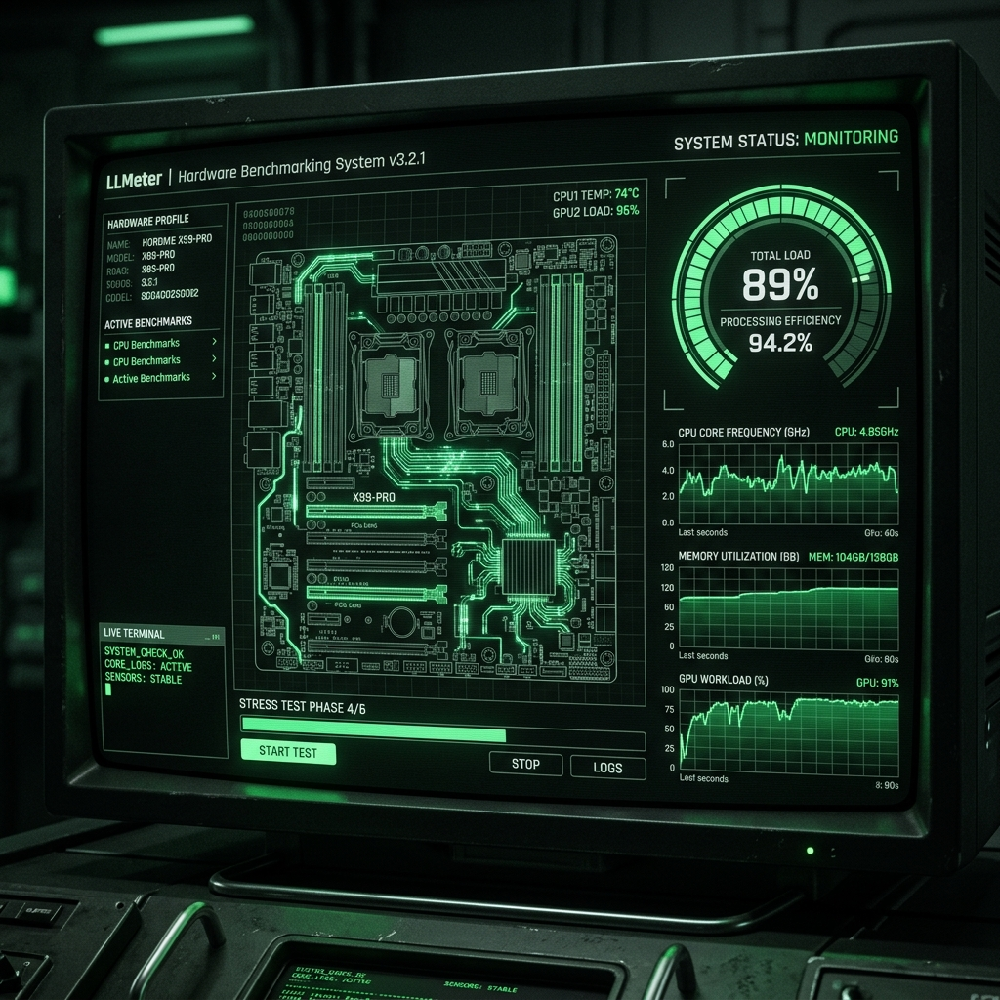

<div align="center">



# 🕹️ LLMeter: Industrial Hardware Benchmark
**The Definitive Command Station for Local LLM Readiness**

[](https://dotusmanali.github.io/llmeter/)
[](https://opensource.org/licenses/MIT)
[](https://github.com/dotusmanali/llmeter)

---

### *Stop Guessing. Start Auditing.*
LLMeter is a browser-native "Industrial Command Station" that benchmarks your hardware to predict Local LLM performance with surgical precision. It transforms raw system specs into an authoritative **Neural Fit Matrix**.

[**Launch Command Station**](https://dotusmanali.github.io/llmeter/)

</div>

---

## ⚡ The Industrial Edge

LLMeter isn't just a benchmark; it's a high-fidelity diagnostic environment. Designed with an **Industrial Command Station** aesthetic, it provides a cinematic experience from boot to audit.

### 🛠️ Key Capabilities

- **🌀 Cinematic Audit Sequence:** A terminal-driven initialization that feels like starting up a mainframe.
- **🗺️ Reactive Hardware Blueprint:** A blueprint-style motherboard visualizer with animated data bus traces and real-time thermal stress mapping.
- **📊 Real Performance Factor (RPF):** Moves beyond static specs. We run JS-Compute loops, Memory Bandwidth bursts, and Storage IPC tests to see how your machine *actually* handles heavy loads.
- **🧩 Neural Fit Matrix:** Instantly see which models (Llama 3, Qwen 2.5, Gemma) will fit in your RAM, factoring in **1.25x memory spikes** and specific quantization levels (q2_k to q8_0).
- **🚀 Tokens/Sec HUD:** Realistic inference speed estimates based on SIMD detection (AVX2, NEON), architecture, and memory throughput.
- **🔌 Ollama Pulse:** Real-time connectivity to your local Ollama instance to audit installed models and suggest optimal upgrades.

---

## 📸 Intelligence Gallery

> [!TIP]
> Visit the [Live Demo](https://dotusmanali.github.io/llmeter/) to see the cinematic transitions, scanlines, and CRT effects in action.

---

## 🚦 Getting Started

### Prerequisites
- **Node.js** v20+
- **pnpm** v9+

### Quick Start
```bash
# 1. Clone the intelligence repository
git clone https://github.com/dotusmanali/llmeter.git
cd llmeter

# 2. Synchronize dependencies
pnpm install

# 3. Launch Development Console
pnpm dev
```

---

## 🏗️ Technical Architecture

LLMeter is built for speed, precision, and privacy.

- **Engine:** Pure JavaScript/WebAssembly micro-benchmarks (Zero side effects).
- **UI:** React + Framer Motion (Cinematic industrial animations).
- **Style:** Tailwind CSS v4 (Industrial Design System).
- **Privacy:** 100% Client-Side. No telemetry leaves your machine.

---

## 📜 Neural License

Distributed under the **MIT License**. See `LICENSE` for the legal protocol.

---

<div align="center">
  
  <br/>
  <i>Engineered for the Local AI Frontier.</i>
</div>
